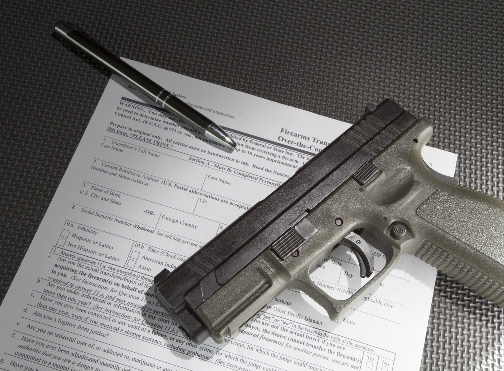
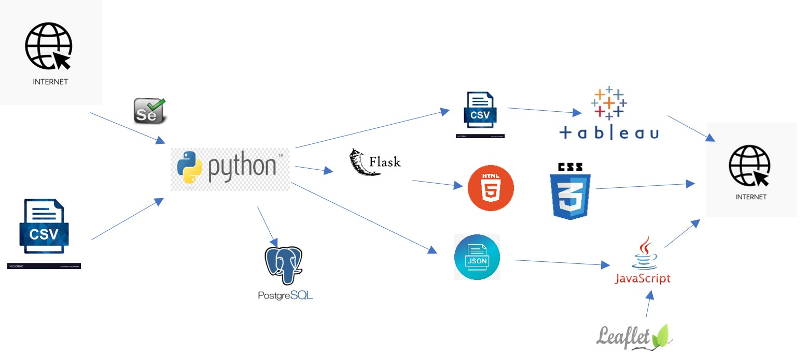

# Gun_Background_Check

## Project 3: Gun Background Checks in the USA By State and Evaluation of factors impacting the Checks

## Project Outline:
In this project, I created a platform/dashboard and three web pages where you can find data related to gun background checks in the USA from the years 2015 to 2022 for each state.
I also created visualizations in correlation with factors (such as Median income, firearm deaths, death rate, and race firearm violence) influencing the need for checking.  

I used a CSV file from [GitHub - BuzzFeedNews/nics-firearm-background-checks: Monthly data from the FBI's National Instant Criminal Background Check System, converted from PDF to CSV](https://github.com/BuzzFeedNews/nics-firearm-background-checks). This data shows the criminal background check from 1998 to 2022. 
I will also use the other three small CSV files and scrap the St Louis FED’s website to retrieve the median household income by state from 2016 to 2021.
The website we will be scraping from: https://fred.stlouisfed.org/release/tables?rid=249&eid=259515#snid=259516 .

### Diagram Process

The data misses out on such information as some laws do not require a background check on the person buying the gun; therefore, this information will not be logged, making it not 100% accurate but still, the most precise way to log the gun sales for us to see the trends in gun purchasing.

